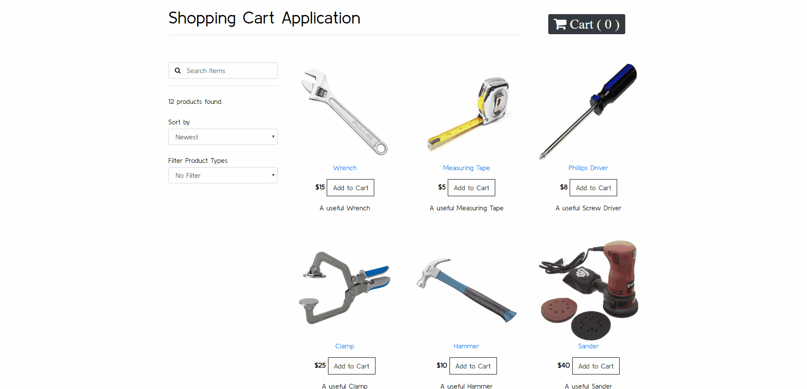

# Shopping Cart Application 



#### This is a application created using React with an Express server
### Created by: Faizan Choudhary

To start the client side application 
```
cd client
npm start
```
Implemeted Express Server to replace old json-server. To run a nodemon version of the server use 
```
npm run serevr 
```
Using a server without nodemon
```
npm run start
```
The server will run on localhost:5000/api/products while the client side is using localhost:3000
